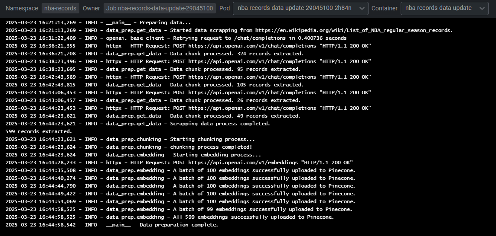

# NBA records chatbot using RAG 🏀🏀⛹🏾‍♂️

Welcome to this NBA chatbot project that uses RAG to answer you about the most impressive records on the league! Basketball, NLP and MLOps at its finest.

## Objective

The main goal of this repository is to demonstrate a fully operational pipeline that deploys a Retrieval-Augmented Generation chatbot to answer questions about NBA records. 

To accomplish this, concepts from NLP — such as semantic search, embedding generation, and context-aware answer synthesis — alongside MLOps practices, like automated data pipelines, modular components, efficient caching, traceability, and full deployment orchestration via Kubernetes were employed.

As a result, these are the components that bring this project to life: 

* `Firecrawl` – Scrapes NBA record data weekly through a scheduled Kubernetes CronJob.
* `OpenAI` – Generates embeddings for each chunk of data and processes user queries when needed.
* `Pinecone Vector Store` – Stores and retrieves embeddings for quick, semantically relevant results.
* `Langchain` – Manages execution chains, routing queries to either direct vector-store lookups or LLM calls.
* `Redis Cache` – Serves as the caching layer, storing answers to repeated queries to reduce re-computation.
* `Firebase` – Keeps track of call metadata and chat history for analytics and easy access.
* `Kubernetes` – Deploys and manages all these components in a local cluster.

## How It Works in a high level

Once in a week a cronjob is run and go to the defined source to scrap the updated content about the records using [`Firecrawl`](https://github.com/mendableai/firecrawl). The result are them separated into chunks in a way that keeps the meaning of the records: `holder`, `record category`, `record value`, `date of the record` and so on. 

Being ready the chunks preparation, its time to embedding process: convert them into a numerical representation that captures semantic meaning. That part is done using an OpenAI embedding model. After being transformed into a bunch of numerical vectors they will be stored in [`Pinecone`](https://github.com/pinecone-io) Vector Store, which will provide us with fast and accurate ranking and retrieval based on similarity search when the project is deployed.

With the vector store live, we just need a way to make the question goes from the input to the answer flawlessly. To do that we're gonna create a runnable chain using [`Langchain`](https://github.com/langchain-ai/langchain) that will be capable:
* Receive the question, access the vector store and return the most confident vector as answer, OR
* Search on a Redis cache if the question was made before and return the answer related to it, OR
* Ok, time to open your wallet and let the chain call the OpenAI providing the `k` most similar vectors as context along to the question to have an accurate answer. 

As soon the LLM service return the answer the cache will be updated and the metadata about the call (model used, finish reason, token usage, fingerprint, etc.) will be stored on a [`Firestore`](https://github.com/firebase) database. Also, the chat history will be stored too and can be integrated in future version as user conversation context (PRs are very welcome here!).

And that is it. All of that running smoothly on a Kubernetes cluster with the certainty that our deploy will scale if needs to and the service will not be short on availability.

## Get Started

To run the project it is pretty simple: First of all, clone the repo and fill the gaps regarding to the APIs keys (links to generate them are on the `.env` file). Set them at: 

* The `.env` file to run locally; and
* The `secrets.yaml` file hashed to 64b (at the `k8s`folder) to run it on Kubernetes.

You gonna need an OpenAI, Pinecone and Firecrawl keys. You're will also need to put the `firebase-keys.json` on the `configs` folder (instructions to do that are on the placeholder file as well).

After that, make sure you have a Kubernetes cluster running on your machine. If you dont have one yet, the easiest way to set one is with the integrated [`Kubernetes cluster on Docker Desktop`](https://docs.docker.com/desktop/features/kubernetes/).

Then, create a namespace on the cluster and deploy this project to it with the following commmand:

    cd k8s
    kubectl create namespace nba-records
    kubectl apply -f . -n nba-records
    kubectl get pods -n nba-records       ## To check if the deployment went fine

We're all set 🎉. Now go to your `Postman`, `Insomnia` or whatever HTTP Requester you want and send a question to the address `http://localhost:30000/ask`:

And on the pods you can see the logs of the chatbot on action:

And the Cron as well:

## Wrap up

I hope this readme helps you set up and understand the core idea on how to implement a versatile and robust Chatbot with RAG application. Feel free to open issues or pull requests for any improvements!